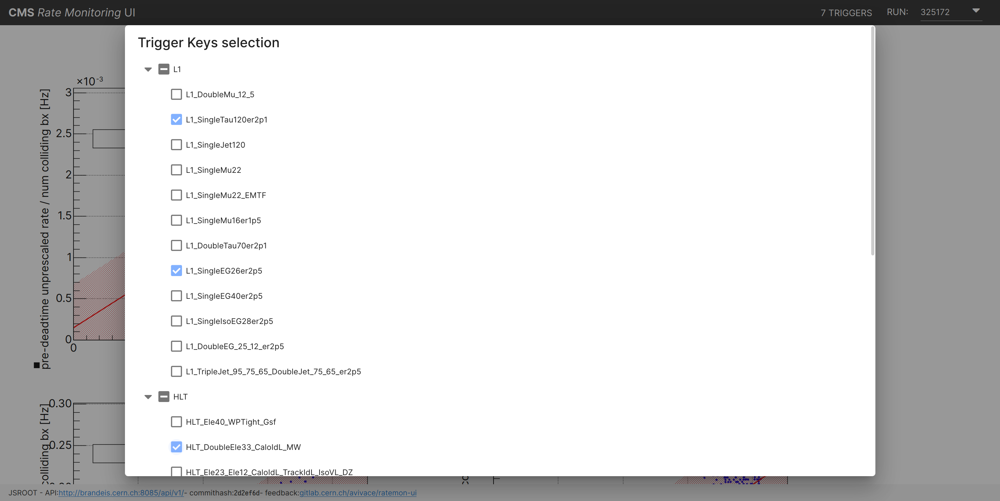

# CMS Rate Monitoring UI

A simple web application powered by [JSROOT](https://root.cern.ch/js/) and VueJS to browse CERN CMS HLT and L1 Trigger Rates, showing interactive ROOT plots, computed fit functions and confidence intervals.

Data source is the [RateMon experimental API](https://gitlab.cern.ch/cms-tsg-fog/ratemon#api), exposing trigger rates plots made produced by the RateMon tools.

## Features

Interactive plots rendering


Trigger Path selection




- [x] Plot specific LHC run
- [x] Plot Pile Up luminosity VS pre-deadtime unprescaled rate (colliding bunches/Hz)
- [x] Trigger selection
- [x] Fit function plotting
- [ ] Allow selecting different Y axis to produce different plots
- [ ] Plot against LS (LumiSections) instead of PU (PileUp luminosity)
- [ ] Plot specific LHC fill
- [ ] Compare different runs/fills
- [ ] Trigger Lists/presets
- [ ] Link-able layouts
- [ ] Pagination
- [ ] Endless (lazy) scrolling


## Public instances

A few development instances are currently running. Most stable one should be on [brandeis.cern.ch:8082](http://brandeis.cern.ch:8082) (you must be on CERN network or proxied through LXPLUS to access this host).

## Running

First, make sure that RateMon is properly configured and working. Then, fire up an instance of the RateMon API. [Instructions here](https://gitlab.cern.ch/cms-tsg-fog/ratemon).

Point the `apiEndpoint` environment variable to the RateMon API public endpoint.

If using the webpack-dev-server, make sure you set the correct public hostname where you are serving the web app. In `vue.config.js`:

```javascript
module.exports = {
  devServer: {
    public: 'subdomain.domain.ext:port'
  }
};
```

```bash
# Project setup
npm install
# Compiles and hot-reloads for development
npm run serve
# Compiles and minifies for production
npm run build
### Lints and fixes files
npm run lint
```
